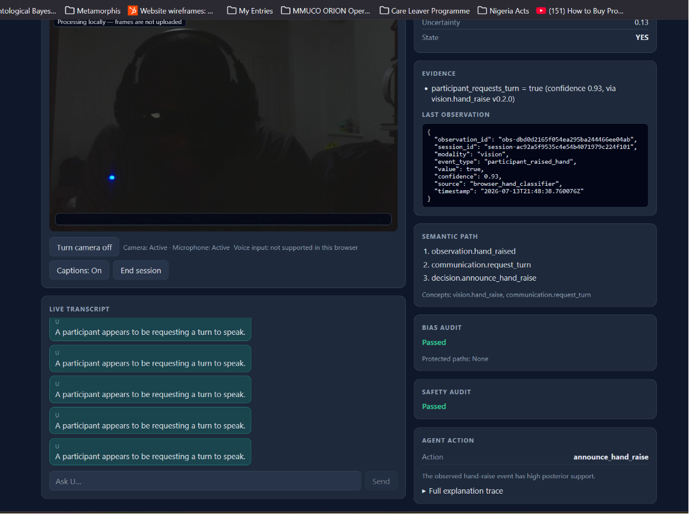

# OBIAI — U

**U** is a browser video-call AI agent built on the **OBI Ontological Bayesian
Intelligence** architecture. It watches for *observable* call events (currently:
a raised hand, detected in-browser with MediaPipe), reasons about them with an
explicitly debiased Bayesian model, and shows its evidence, uncertainty, and
audits for every decision.

> “Hi, I am U.”



The architecture separates:

1. **Ontology** — explicit concepts and relations (`obiai.ontology`).
2. **Bayesian inference** — exact, φ-marginalized belief updates (`obiai.bayesian`).
3. **Epistemic traversal** — AEGIS Filter-Flash DAG (`obiai.epistemic`).
4. **Bias auditing** — protected attributes are measured and controlled rather than hidden (`obiai.bias`).
5. **Safety** — observable-events-only allowlist; no protected-trait inference from video (`obiai.safety`).
6. **Agent planning** — YES / NO / MAYBE with uncertainty gates; MAYBE can only ask for clarification (`obiai.agents`).
7. **Sessions & realtime** — in-memory sessions, WebSocket event streams (`obiai.memory`, `obiai.realtime`, `obiai.api`).
8. **Dynamic modules** — capabilities load without changing the core (`obiai.modules`).

The bias model implements the Unbiased AI paper's marginalization
`P(θ|D) = ∫P(θ,φ|D)dφ` as an exact discrete sum — see
[docs/traceability.md](docs/traceability.md) for the full paper-to-code map.

## Install (backend)

```bash
python -m venv .venv
source .venv/bin/activate          # Windows: .venv\Scripts\activate
pip install -e ".[dev]"
```

## Run U

```bash
uai doctor          # environment sanity check
uai demo            # raised-hand vertical slice in the terminal
uai serve           # backend on http://127.0.0.1:8000
```

## Train UAI

Install the training extras, prepare the OASST2 data, then fine-tune the UAI
LoRA adapter through the main OBIAI CLI:

```bash
pip install -e ".[train]"
obiai train uai --limit 128 --max-steps 8 --grad-accum 4
```

By default the command reads
`ml/data/oasst2/sft_pairs_weighted.jsonl` and writes the adapter under
`ml/checkpoints/pythia-2.8b-oasst2-qlora`. Pass `--data` or `--output` to
override those paths.

Web client (Node 18+):

```bash
cd web
npm install
npm run dev         # http://localhost:5173 (proxies to the backend)
```

Open http://localhost:5173, click **Enable camera and microphone**, then
**Start session**. Raise your hand for half a second: U announces
“A participant appears to be requesting a turn to speak.” and the panels show
the posterior (0.93), uncertainty, YES state, evidence with provenance, the
semantic path through the epistemic DAG, and the bias/safety audits.

Hand tracking runs entirely in your browser; only structured events such as
`participant_raised_hand` are sent to the backend — never frames or audio.
Video and audio are not stored by default, and deleting a session wipes all of
its data.

### Voice input and live captions

Click **Start listening** to talk to U. Speech recognition runs in the
browser (the Web Speech API) — only recognized *text* crosses the wire as
`transcript.partial` / `transcript.final` WebSocket events, never raw audio.
Interim results appear live in the caption bar under the video (toggle with
**Captions**, independently of whether the microphone is on); a finalized
utterance is added to the transcript as your turn and answered by U like any
other chat message. Requires a Chromium-based browser (Web Speech API is not
implemented in Firefox); unsupported browsers show "Voice input: not
supported" and typed chat still works.

A server-side audio-stream transcription provider (e.g. faster-whisper) is
designed for behind `obiai.core.protocols.SpeechToTextProvider` but not
implemented — this keeps STT dependency-free for the vertical slice while the
interface stays ready for a future swap.

## Legacy OBIAI agent

The original demo agent is unchanged:

```bash
obiai demo
obiai reason --evidence rain=true --evidence sprinkler=false
pytest
```

## Design rules

- A protected attribute may be retained for auditing, but it must not silently
  become a causal decision path — any ontology path from a protected attribute
  to a proposition fails the bias audit and withholds the action.
- The vision layer may only claim observable events (hand raised, camera
  blocked, ...). It must never infer medical status, disability, ethnicity,
  emotion, honesty, or any other internal or protected trait.
- Decisions always expose: proposition, posterior probability, uncertainty,
  YES / NO / MAYBE state, evidence with provenance, ontological concepts,
  semantic path, bias audit, safety audit, selected action, and a full
  explanation trace.
