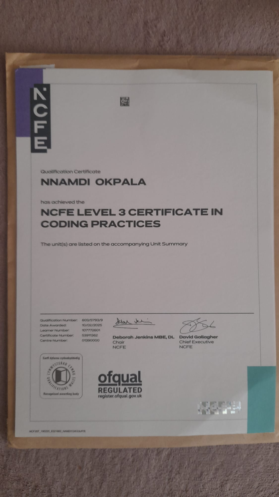
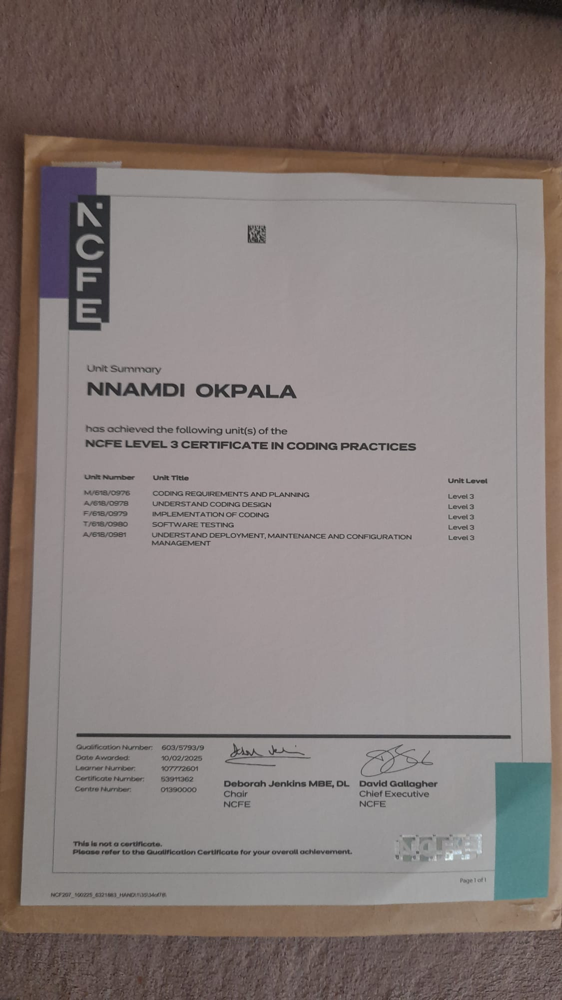

# Certificates

This page preserves certificate evidence as accessible documentation images.

## NCFE Level 3 Certificate in Coding Practices

Awarded to Nnamdi Okpala on 10/02/2025 for the NCFE Level 3 Certificate in Coding Practices.

## Unit Summary

The unit summary lists coding requirements and planning, coding design, implementation of coding, software testing, and deployment, maintenance and configuration management.

